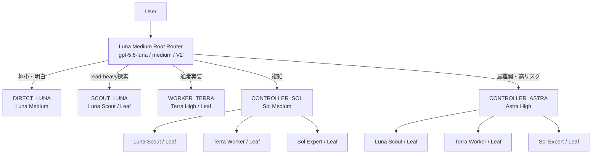

# Codex Multi-Agent Orchestrator

Codex Multi-Agent V2 の公開可能な設定、agent role、Metricsを管理するリポジトリです。

## 安全な設定分離

公開リポジトリには端末固有の `config.toml` を保存しません。利用時は
`config.example.toml` をテンプレートとして `CODEX_HOME/config.toml` に適用します。

```powershell
.
\scripts\install.ps1
```

既存の `config.toml` は日時付きバックアップを作成し、公開テンプレートが管理するキー・sectionだけを更新します。`notify`、MCP、trusted projectなど、管理対象外の既存設定は保持します。

適用前に確認する場合:

```powershell
.\scripts\install.ps1 -WhatIf
```
個人パス、MCP接続、通知コマンド、trusted project、session、認証情報は公開設定から除外しています。

## 含まれるもの

- `agents/`: Scout、Worker、Controller、Expertのrole設定
- `metrics/`: rollout解析、smoke test、context/返却結果サイズ観測
- `config.example.toml`: 端末非依存の公開テンプレート

`model_auto_compact_token_limit` は意図的に設定していません。Rootと子agentの実測後に判断します。

## 中心思想

この構成は、安価なモデルだけで全てを処理するのではなく、`gpt-5.6-luna / medium`を常時Root Routerとして使い、タスクの複雑度とリスクに応じて高価なモデルを限定的に起動します。

```text
Luna Medium Root
  ├─ DIRECT_LUNA       極小・明白な処理
  ├─ SCOUT_LUNA        read-heavyな探索
  ├─ WORKER_TERRA      通常実装
  ├─ CONTROLLER_SOL    複雑な調査・設計・実装
  └─ CONTROLLER_ASTRA  最難関・高リスク
```



Rootの責務はrouting、task packet構築、結果統合、escalation判断に限定します。通常実装にTerra Controllerは置かず、`Luna → Terra High Worker`で直接処理します。LeafはScout、Terra Worker、Sol Expertとし、再委譲させません。ControllerはSol/Astraだけとし、必要なLeafだけを通常1〜2体起動します。

## Contextと結果の扱い

子agentには原則`fork_turns = "none"`を使い、Rootの長い履歴を複製しません。代わりに次のtask packetを渡します。

```text
Original goal
Assigned subtask
Relevant files / evidence
Constraints
Acceptance criteria
Expected response
```

Root contextは全agentの作業履歴ではなく、routing stateとdistilled knowledgeを保持する場所です。ControllerはLeafのraw outputをそのままRootへ転送せず、必要な知識へ圧縮します。

`model_context_window = 872000`はheadroomを持たせる設定です。一方、`model_auto_compact_token_limit`はglobal設定せず、Rootと子agentの実測後に判断します。

Context関連の用語は次の意味です。

| 用語 | 日本語での意味 | 値 |
|---|---|---:|
| `catalog.context_window`（モデルの標準値） | config未指定時のcatalog基準値 | 272000 |
| `catalog.max_context_window`（configで指定できる上限） | modelごとに許可された最大値 | 872000 |
| `model_context_window`（config.tomlの指定値） | この構成が実際に指定するwindow | 872000 |

## Metricsの役割

MetricsのSource of Truthは、モデルの自己申告ではなく次のrollout JSONLです。

```text
%USERPROFILE%\\.codex\\sessions\\**\\rollout-*.jsonl
```

- `smoke.py`: 配線、実効model/effort/V2、context観測
- `collect.py`: rolloutからturn単位Metricsを生成
- `report.py`: 期間集計、完遂率、昇格率、token、返却結果サイズを表示
- `timeline.py`: session → turn → agentの時系列表示

Metricsは設定を自動変更しません。変更前後、token cost、完遂率、rollback条件を記録し、人間が判断します。

## Smoke Testの基本

設定変更後はCodexを完全終了して再起動し、新規sessionで確認します。

```powershell
$SmokeStart = Get-Date
# ここでCodex上のSmoke Testを実行
python "$env:USERPROFILE\\.codex\\metrics\\smoke.py" `
  --since $SmokeStart.ToString("o") `
  --expect controller_sol_scout `
  --context `
  --table
```

配線確認と、agent名を指定しない自然言語Routing確認は分けて実施してください。Astraは高コストのため、初回から常用しません。

### Astraの配線Smoke Test

Astraは高価なため、Astra Controllerが起動することだけを最小コストで確認します。AstraからScout、Worker、Expertをspawnさせません。

Codexで次のpromptを実行します。

```text
Multi-Agent Smoke Testです。

Rootは必ず controller_astra agent を1体だけ起動してください。
Root自身ではタスクを処理しないでください。

controller_astra は他のagentを起動せず、read-onlyでこのrepositoryのトップレベル構成を簡単に確認してください。
ファイルの変更、実装、詳細調査は不要です。

確認が完了したら、controller_astra は次の文字列を含めてRootへ結果を返してください。

ASTRA_SMOKE_OK

Rootはcontroller_astraの結果をそのまま簡潔にまとめてください。

不要なagentは起動しないでください。
```

実行直前に開始時刻を保存します。

```powershell
$SmokeStart = Get-Date
```

Codexでpromptを実行した後、次を実行します。

```powershell
python "$env:USERPROFILE\.codex\metrics\smoke.py" `
  --since "$($SmokeStart.ToString('o'))" `
  --expect controller_astra `
  --table
```

正常時は概ね次のようになります。

```text
[OK] ROOT | gpt-5.6-luna / medium / v2
└─ [OK] controller_astra | gpt-6-astra / high / v2

RESULT: PASS
```

このテストの目的はAstraの配線確認だけです。Astraがさらにagentをspawnした場合は、期待していない追加tokenの原因として扱います。

## 改修時のルール

一般的なbest practiceへ機械的に寄せず、次を変更記録に残します。

- 変更前 / 変更後
- 変更理由
- token costへの影響
- 完遂率への影響
- rollback条件
- Smoke Test
- Metricsによる評価方法

詳細な設計理由と意思決定は[`docs/ARCHITECTURE.md`](docs/ARCHITECTURE.md)と[`docs/DESIGN-DECISIONS.md`](docs/DESIGN-DECISIONS.md)に整理しています。Luna Rootの設計と実装が一時的にずれていた経緯は[`docs/ROUTER-HISTORY.md`](docs/ROUTER-HISTORY.md)、wait/status pollingの設定理由は[`docs/WAIT-POLLING.md`](docs/WAIT-POLLING.md)に記録しています。
