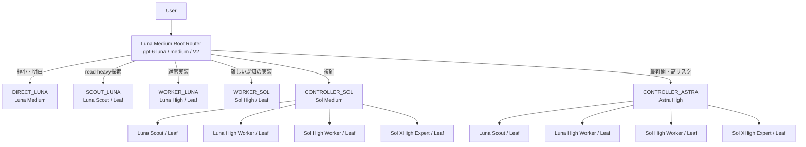

# Codex Multi-Agent Orchestrator

Codex Multi-Agent V2 の公開可能な設定、agent role、Metricsを管理するリポジトリです。

## 安全な設定分離

公開リポジトリには端末固有の `config.toml` を保存しません。利用時は
`config.example.toml` をテンプレートとして `CODEX_HOME/config.toml` に適用します。

```powershell
.
\scripts\install.ps1
```

既存の `config.toml` は日時付きバックアップを作成し、公開テンプレートが管理するキー・sectionだけを更新します。`notify`、MCP、trusted projectなど、管理対象外の既存設定は保持します。

適用前に確認する場合:

```powershell
.\scripts\install.ps1 -WhatIf
```

Root routing指示も`CODEX_HOME/AGENTS.md`へ適用する場合は、既存ファイルを日時付きでバックアップしたうえで明示的に指定します。

```powershell
.\scripts\install.ps1 -InstallRootInstructions -WhatIf
.\scripts\install.ps1 -InstallRootInstructions
```

`-InstallRootInstructions`を省略した場合、既存の`CODEX_HOME/AGENTS.md`は変更しません。

個人パス、MCP接続、通知コマンド、trusted project、session、認証情報は公開設定から除外しています。

## 含まれるもの

- `agents/`: Scout、Worker、Controller、Expertのrole設定
- `metrics/`: rollout解析、smoke test、context/返却結果サイズ観測
- `config.example.toml`: 端末非依存の公開テンプレート

`model_auto_compact_token_limit` は意図的に設定していません。Rootと子agentの実測後に判断します。

## 中心思想

この構成は、通常時に`gpt-6-luna / medium`をRoot Routerとして使い、タスクの複雑度とリスクに応じて高いeffortと上位モデルを限定的に起動します。Composerまたは依頼本文でモデルやroleが明示された場合はその指定を優先します。

```text
Luna Medium Root
  ├─ DIRECT_LUNA       極小・明白な処理
  ├─ SCOUT_LUNA        read-heavyな探索
  ├─ WORKER_LUNA       通常実装
  ├─ WORKER_SOL        難しいが境界の明確な実装
  ├─ CONTROLLER_SOL    複雑な調査・設計・実装
  └─ CONTROLLER_ASTRA  最難関・高リスク
```

以下のtreeはLunaをRootにした自動ルーティング時を示します。別モデルがRootとして明示選択されている場合はそのモデルを優先し、作業形態は依頼の範囲で決めます。



Rootの責務はrouting、task packet構築、結果統合、escalation判断に限定します。通常実装は`Luna Medium Root → Luna High Worker`で直接処理し、難しい既知の実装はSol High Workerへ送ります。LeafはScout、Luna/Sol Worker、Sol XHigh Expertとし、再委譲させません。ControllerはSol/Astraだけとし、必要なLeafだけを通常1〜2体起動します。

## Routing判定表

Luna Rootは最終成果物、探索の必要性、変更scope、不確実性、失敗リスク、必要な検証を順に確認し、最小で完遂可能なrouteを一つ選びます。コストはRouteの成立条件を満たした後にだけ比較します。Composerまたは依頼本文で指定されたmodel/roleは自動判定より優先し、`read-only`・調査のみ等の指定は操作範囲を制約しますが、明示modelを下位Routeへ変更しません。

| 依頼の状態 | Route | 例 | 選ばない条件 |
|---|---|---|---|
| 対象・場所・操作が既知で、探索・複数証拠の照合・原因分析・挙動変更がすべて不要 | `DIRECT_LUNA` | 会話内の説明、翻訳、既知の単一値、完全指定されたtypo | `rg`、file探索、複数資料の比較、設計・実装判断が必要 |
| 未知の事実・現在状態・根拠の取得だけ | `SCOUT_LUNA` | symbol、call path、関連test、設定、履歴、文書の確認 | 書込みが必要、または難しい因果・設計判断が核心 |
| scopeと受入条件が明確な通常変更 | `WORKER_LUNA` | bug fix、test追加、局所refactor、挙動に影響する1ファイル変更 | 難しい中核判断、広い設計判断、原因不明の複数module障害 |
| 難しいが責務と受入条件が定まった変更 | `WORKER_SOL` | 既知の複数箇所変更、局所的な非自明のcorrectness判断 | 未知のroot cause、複数制約の設計統合、Astra級の高リスク判断 |
| 原因不明、複数制約の統合、難しい調査結果の解釈 | `CONTROLLER_SOL` | 非自明refactor、API移行、複数module、read-onlyの設計分析 | 作業量だけが大きい、または狭く既知な実装 |
| 高失敗コストで、Solでも重要な不確実性が残る | `CONTROLLER_ASTRA` | concurrency、distributed state、security-sensitive、破壊的migration | 予防的な高性能化、通常の調査・実装 |

過少routingを避けるため、未知の対象探索、複数証拠の照合、原因切り分け、設計・実装方針の選択をDirectで行いません。GPT-6 Lunaの能力向上は通常Workerの担当範囲に反映し、Directの条件は緩めません。調査規模が小さいことやagent起動オーバーヘッドはDirectへ下げる理由になりません。最終成果物が明確な変更ならScoutを儀式的に挟まずWorkerへ直接送り、依頼時点の証拠でLuna HighとSol Highを選びます。下位effortを毎回順番に試す方式にはしません。

## Contextと結果の扱い

子agentには原則`fork_turns = "none"`を使い、Rootの長い履歴を複製しません。代わりに次のtask packetを渡します。

```text
Objective
Known facts / evidence
Unknowns
Scope
Allowed
Forbidden
Acceptance criteria
Verification
Authorization
Escalation
```

`AGENTS.md`をrouting・delegation・出力契約のcanonical sourceとします。`agents/*.toml`はrole固有の実行境界と固定route/statusを定義し、判定規則を重複して別解釈しません。将来、下位directoryに別の`AGENTS.md`またはrole契約を追加する場合は、canonical sourceへの参照、優先順位、差分理由を同じ変更で文書化します。

Root contextは全agentの作業履歴ではなく、routing stateとdistilled knowledgeを保持する場所です。ControllerはLeafのraw outputをそのままRootへ転送せず、必要な知識へ圧縮します。

`model_context_window = 872000`はheadroomを持たせる設定です。一方、`model_auto_compact_token_limit`はglobal設定せず、Rootと子agentの実測後に判断します。

Context関連の用語は次の意味です。

| 用語 | 日本語での意味 | 値 |
|---|---|---:|
| `catalog.context_window`（モデルの標準値） | config未指定時のcatalog基準値 | 272000 |
| `catalog.max_context_window`（configで指定できる上限） | modelごとに許可された最大値 | 872000 |
| `model_context_window`（config.tomlの指定値） | この構成が実際に指定するwindow | 872000 |

## Metricsの役割

MetricsのSource of Truthは、モデルの自己申告ではなく次のrollout JSONLです。

```text
%USERPROFILE%\\.codex\\sessions\\**\\rollout-*.jsonl
```

- `smoke.py`: 配線、実効model/effort/V2、context観測
- `collect.py`: rolloutからturn単位Metricsを生成
- `report.py`: 期間集計、完遂率、昇格率、token、API USD換算とCodex追加クレジット換算の参考値を表示
- `timeline.py`: session → turn → agentの時系列表示

Metricsは設定を自動変更しません。変更前後、token cost、完遂率、rollback条件を記録し、人間が判断します。
追加クレジット換算はプラン内利用枠の減少量を表しません。自然言語でのRoute判定とSol Workerのeffort比較は[Routing回帰確認](metrics/docs/ROUTING-EVAL.md)に記載します。

## Smoke Testの基本

設定変更後はCodexを完全終了して再起動し、新規sessionで確認します。

```powershell
$SmokeStart = Get-Date
# ここでCodex上のSmoke Testを実行
python "$env:USERPROFILE\\.codex\\metrics\\smoke.py" `
  --since $SmokeStart.ToString("o") `
  --expect controller_sol_scout `
  --context `
  --table
```

配線Smoke Testと、agent名を指定しない自動Routing Testは別の検証です。Smoke Testは指定したrole/model/階層が実効化されるかだけを確認し、判断品質を証明しません。自動Routing Testは固定のケース表に対するroute選択と、under-routing/over-routingの評価を確認します。Astraは高コストのため、初回から常用しません。ケースと手順は[`metrics/docs/SMOKE.md`](metrics/docs/SMOKE.md)を参照してください。

### Astraの配線Smoke Test

Astraは高価なため、Astra Controllerが起動することだけを最小コストで確認します。AstraからScout、Worker、Expertをspawnさせません。

Codexで次のpromptを実行します。

```text
Multi-Agent Smoke Testです。

Rootは必ず controller_astra agent を1体だけ起動してください。
Root自身ではタスクを処理しないでください。

controller_astra は他のagentを起動せず、read-onlyでこのrepositoryのトップレベル構成を簡単に確認してください。
ファイルの変更、実装、詳細調査は不要です。

確認が完了したら、controller_astra は次の文字列を含めてRootへ結果を返してください。

ASTRA_SMOKE_OK

Rootはcontroller_astraの結果をそのまま簡潔にまとめてください。

不要なagentは起動しないでください。
```

実行直前に開始時刻を保存します。

```powershell
$SmokeStart = Get-Date
```

Codexでpromptを実行した後、次を実行します。

```powershell
python "$env:USERPROFILE\.codex\metrics\smoke.py" `
  --since "$($SmokeStart.ToString('o'))" `
  --expect controller_astra `
  --table
```

正常時は概ね次のようになります。

```text
[OK] ROOT | gpt-6-luna / medium / v2
└─ [OK] controller_astra | gpt-6-astra / high / v2

RESULT: PASS
```

このテストの目的はAstraの配線確認だけです。Astraがさらにagentをspawnした場合は、期待していない追加tokenの原因として扱います。

## 改修時のルール

一般的なbest practiceへ機械的に寄せず、次を変更記録に残します。

- 変更前 / 変更後
- 変更理由
- token costへの影響
- 完遂率への影響
- rollback条件
- Smoke Test
- Metricsによる評価方法

詳細な設計理由と意思決定は[`docs/ARCHITECTURE.md`](docs/ARCHITECTURE.md)と[`docs/DESIGN-DECISIONS.md`](docs/DESIGN-DECISIONS.md)に整理しています。Luna Rootの設計と実装が一時的にずれていた経緯は[`docs/ROUTER-HISTORY.md`](docs/ROUTER-HISTORY.md)、wait/status pollingの設定理由は[`docs/WAIT-POLLING.md`](docs/WAIT-POLLING.md)に記録しています。
