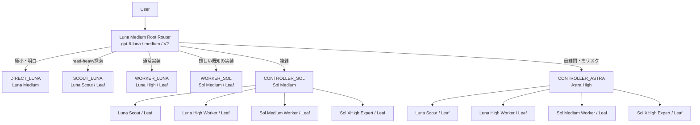

# Architecture

## 目的

通常時はGPT-6 Luna MediumをRoot Routerとして使い、明確な通常実装はLuna High Worker、難しい既知の実装はSol Medium Worker、設計判断の統合はSol Controller、最難関はAstra Controllerへ送ります。Composerまたは依頼本文でmodel・roleが明示された場合はその指定を優先します。

最適化対象はtoken数だけではありません。

```text
完遂率を維持
  + 高価なmodelの使用を限定
  + context複製を抑制
  + agent hopを抑制
  + 不要なretry / wait pollingを抑制
```

## Tree

以下はLunaをRootにした自動ルーティング時のtreeです。別モデルがRootとして明示選択されている場合はそのモデルを優先し、同じ役割のagentを重複起動しません。



```text
Root: Luna Medium / V2
├─ Direct: Luna Medium
├─ Scout: Luna Medium / Leaf
├─ Worker: Luna High / Leaf
├─ Difficult Worker: Sol Medium / Leaf
├─ Sol Controller: Sol Medium
│  ├─ Scout
│  ├─ Worker
│  └─ Expert
└─ Astra Controller: Astra High
   ├─ Scout
   ├─ Worker
   └─ Expert
```

通常の上限は`Root → Controller → Leaf`です。Leafは再委譲せず、Controllerは必要なLeafだけを起動します。V2の同時実行上限4 threadでは、RootとControllerの下で同時に動くLeafは最大2体です。

## Routing

Luna Rootは最終成果物、探索の必要性、scope、不確実性、risk、verificationをこの順に評価し、最小で完遂可能なrouteを一つ選ぶ。コストはRoute成立後にだけ比較する。Composerまたは依頼本文で指定されたrole/modelは自動判定より優先し、Root自身が選択modelなら同tier agentを重複起動しない。read-only制約は操作範囲を制限するが明示modelを下位Routeへ変更しない。詳細な実行規則のcanonical sourceはリポジトリrootの[`AGENTS.md`](../AGENTS.md)である。

| Route | 担当 | 選択条件 | 境界 |
|---|---|---|---|
| `DIRECT_LUNA` | Luna Root | 対象・場所・操作が既知で、探索・複数証拠の照合・原因分析・挙動変更がすべて不要 | 条件をすべて満たす場合だけ。agent起動コストで緩和しない |
| `SCOUT_LUNA` | Luna Scout | 未知の事実・現在状態・根拠をrepository、設定、履歴、log、文書から取得するread-only調査 | 小規模でもDirectへ下げない。難しい因果・設計判断はSolへ |
| `WORKER_LUNA` | Luna High Worker | scopeと受入条件が明確な通常変更、bug fix、test、局所refactor | 限定的な事前確認は自身で行う。難しい中核判断はSolへ昇格 |
| `WORKER_SOL` | Sol Medium Worker | 難しいが責務・受入条件が明確な既知の変更 | 未知のroot causeや複数制約の統合はSol Controllerへ、最難関riskはAstraへ |
| `CONTROLLER_SOL` | Sol Medium | 複数module、原因不明、調査結果の解釈、設計判断、非自明なrefactor/API移行 | read-onlyでも難しい原因・設計判断を含む。独立するLeaf作業だけを委譲 |
| `CONTROLLER_ASTRA` | Astra High | Solで解消できない重要な不確実性を持つ高失敗コストの問題 | 高コストの予防利用はしない |

`DIRECT_LUNA` の成立条件はGPT-6 Lunaの能力向上によって緩めない。モデルやeffortを毎回低い順に試す方式にはせず、依頼時点の証拠でRouteを選ぶ。Sol XHigh ExpertはController配下の限定分析・レビューに使う。

## Task packetとcontext ownership

`fork_turns = "none"`を原則とし、以下のself-contained packetを渡します。

```text
Objective / Known facts / evidence / Unknowns / Scope / Allowed / Forbidden
Acceptance criteria / Verification / Authorization / Escalation
```

role contractはrootの`AGENTS.md`をcanonical source、`agents/*.toml`をrole固有境界の同期先とする。下位の`AGENTS.md`または契約を増やす場合は、rootとの優先順位・参照・差分理由を明文化する。

```text
Root context = routing state + distilled knowledge
Root context ≠ 全agentのraw作業履歴
```

Rootへ返す結果は、結論、根拠、変更内容、検証、未解決riskに圧縮します。

## 深さと権限

V2では設定上の`max_depth`だけをhard enforcementとして信用しません。role instructions、task packet、Smoke Test、Metricsでtree構造を担保します。`sandbox_mode = "read-only"`も意図を示すものであり、hard security boundaryとは限らないため、Scout/Expertの非変更ルールを指示と検証で重ねます。

## 観測

- `smoke.py`: 配線と実効設定
- `collect.py`: rollout JSONLからturn単位へ変換
- `report.py`: 期間・model・task単位の集計
- `timeline.py`: session → turn → agentの時系列

Source of Truthは`%USERPROFILE%\\.codex\\sessions\\**\\rollout-*.jsonl`です。Metricsは自動設定変更を行いません。
