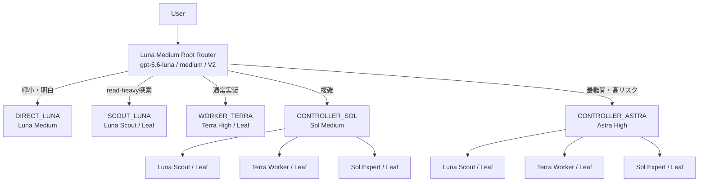

# Architecture

## 目的

このオーケストレーターは、安価なモデルだけで全てを処理する構成ではありません。Lunaを常時Root Routerとして使い、タスクの複雑度とリスクに応じてTerra、Sol、Astraへ限定的に委譲します。

最適化対象はtoken数だけではありません。

```text
完遂率を維持
  + 高価なmodelの使用を限定
  + context複製を抑制
  + agent hopを抑制
  + 不要なretry / wait pollingを抑制
```

## Tree



```text
Root: Luna Medium / V2
├─ Direct: Luna Medium
├─ Scout: Luna Medium / Leaf
├─ Worker: Terra High / Leaf
├─ Sol Controller: Sol Medium
│  ├─ Scout
│  ├─ Worker
│  └─ Expert
└─ Astra Controller: Astra High
   ├─ Scout
   ├─ Worker
   └─ Expert
```

通常の上限は`Root → Controller → Leaf`です。Leafは再委譲せず、Controllerは必要なLeafだけを起動します。通常は1〜2 Leaf、最大3 Leafを目安にします。

## Routing

Rootは依頼種別、scope、不確実性、複雑性、risk、verificationをこの順に評価し、最小で完遂可能なrouteを一つ選ぶ。ユーザー指定のrole/modelは、安全性・利用可能性・read-only制約と矛盾しない限り優先する。詳細な実行規則のcanonical sourceはリポジトリrootの[`AGENTS.md`](../AGENTS.md)である。

| Route | 担当 | 選択条件 | 境界 |
|---|---|---|---|
| `DIRECT_LUNA` | Luna Root | 極小・明白かつ可逆で、探索・設計判断・専用検証が不要 | 未調査の原因や複数moduleの整合を推測しない |
| `SCOUT_LUNA` | Luna Scout | read-heavy探索、設定・symbol・call path確認のみ | read-only。実装しない |
| `WORKER_TERRA` | Terra High Worker | scopeと受入条件が明確な実装、bug fix、test、局所refactor | 広いarchitecture、曖昧な複数module root cause、重大riskはSolへ昇格 |
| `CONTROLLER_SOL` | Sol Medium | 複数module、原因不明、設計判断、調査と実装の統合 | 作業量だけでは選ばず、独立するLeaf作業だけを委譲 |
| `CONTROLLER_ASTRA` | Astra High | Solで解消できない重要な不確実性を持つ高失敗コストの問題 | 高コストの予防利用はしない |

## Task packetとcontext ownership

`fork_turns = "none"`を原則とし、以下のself-contained packetを渡します。

```text
Objective / Known facts / evidence / Unknowns / Scope / Allowed / Forbidden
Acceptance criteria / Verification / Authorization / Escalation
```

role contractはrootの`AGENTS.md`をcanonical source、`agents/*.toml`をrole固有境界の同期先とする。下位の`AGENTS.md`または契約を増やす場合は、rootとの優先順位・参照・差分理由を明文化する。

```text
Root context = routing state + distilled knowledge
Root context ≠ 全agentのraw作業履歴
```

Rootへ返す結果は、結論、根拠、変更内容、検証、未解決riskに圧縮します。

## 深さと権限

V2では設定上の`max_depth`だけをhard enforcementとして信用しません。role instructions、task packet、Smoke Test、Metricsでtree構造を担保します。`sandbox_mode = "read-only"`も意図を示すものであり、hard security boundaryとは限らないため、Scout/Expertの非変更ルールを指示と検証で重ねます。

## 観測

- `smoke.py`: 配線と実効設定
- `collect.py`: rollout JSONLからturn単位へ変換
- `report.py`: 期間・model・task単位の集計
- `timeline.py`: session → turn → agentの時系列

Source of Truthは`%USERPROFILE%\\.codex\\sessions\\**\\rollout-*.jsonl`です。Metricsは自動設定変更を行いません。
