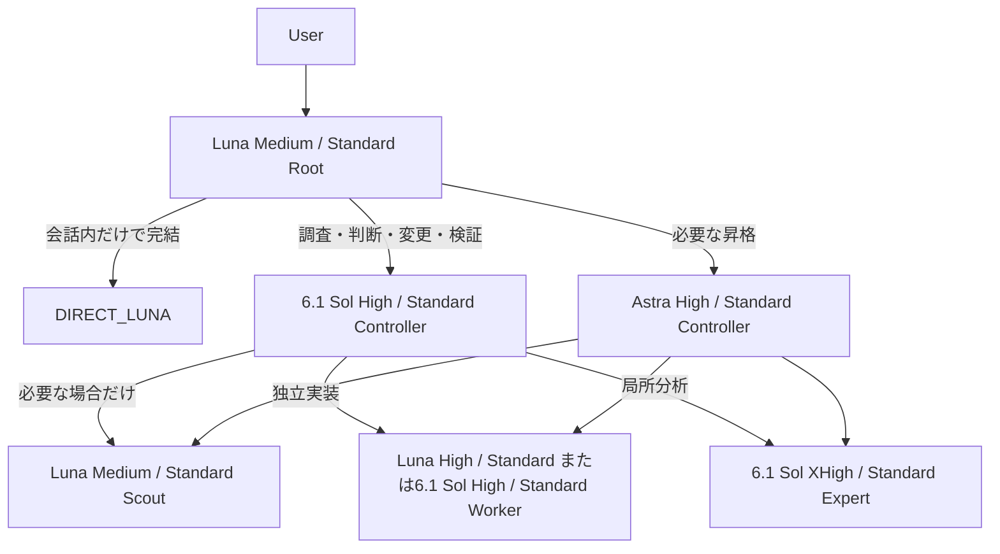

# Architecture

## 目的と責務

RootはGPT-6 Luna / medium / Standardで依頼を分類し、task packetを渡し、主担当の回答を配送します。会話内の単純処理だけをDirectにし、調査・判断・ファイル操作・実装・検証が必要な通常依頼はGPT-6.1 Sol / high / Standardへ渡します。Lunaが委譲前に調査したり、結果の専門的判断をやり直したりする構成にはしません。

```mermaid
flowchart TD
    U[User] --> R["Luna Medium / Standard Root"]
    R -->|"会話内だけで完結"| D[DIRECT_LUNA]
    R -->|"調査・判断・変更・検証"| C["6.1 Sol High / Standard Controller"]
    R -->|"必要な昇格"| A["Astra High / Standard Controller"]
    C -->|"必要な場合だけ"| S["Luna Medium / Standard Scout"]
    C -->|"独立実装"| W["Luna High / Standard または6.1 Sol High / Standard Worker"]
    C -->|"局所分析"| E["6.1 Sol XHigh / Standard Expert"]
    A --> S
    A --> W
    A --> E
```

Controllerは必要な調査、設計、実装、テスト、最終回答まで通常は自身で完遂します。毎回Leafを起動しません。独立性・明確な所有範囲・待ち時間削減の利益がある場合だけ、通常1～2 Leafへ委譲します。Rootの自動初期RouteはDirect / Sol Controller / Astra Controllerの3つです。Scout/Workerの直接起動は明示role指定に限ります。明示modelとして適合するRootが動作中なら同役割を重複起動しません。

## 設定と速度

model、reasoning effort、service tierは独立です。Rootとすべてのregistered roleにはStandard (`default`) を明示します。速度省略による意図しない継承を防ぎます。feature flagのfast_modeは選択機能の有効化であり、全roleのFast指定ではありません。

実効tierはrolloutが記録する範囲で観測します。tierがない・自動選択で確定できない場合は未検証とし、設定の静的検証を実運用の成功と混同しません。

## Task packetとcontext ownership

原則 `fork_turns = "none"` を使い、Objective、Known facts / evidence、Unknowns、Scope、Allowed、Forbidden、Acceptance criteria、Verification、Authorization、Escalationを含むpacketを渡します。Workerに他者の変更をrevertさせません。

Rootはrouting stateとdistilled knowledgeを持ち、全agentのraw作業履歴を保持しません。ControllerはLeafの根拠を統合し、そのままユーザーへ届けられるUSER_RESULTを返します。Rootは結論・根拠・検証範囲・残課題を保持して配送し、独自の結論へ書き換えません。

契約のcanonical sourceは[`AGENTS.md`](../AGENTS.md)、role固有境界は`agents/*.toml`です。Leafは再委譲せず、Controllerは別Controllerを起動しません。Astraへの昇格はRootへ返します。

## Contextと権限

既存のmodel_context_window=872000は維持し、auto-compactのglobal overrideは追加しません。上限指定自体は使用token量ではありません。APIの272K超の実入力は長文脈料金ですが、Codexの利用枠に同じ倍率を適用しません。

V2のmax_depthだけをhard enforcementとみなさず、role指示・packet・Smoke Testで階層を確認します。read-only roleはファイル非変更の指示も守ります。

## 観測

Source of Truthは`%USERPROFILE%/.codex/sessions/**/rollout-*.jsonl`です。Metricsは受動解析に限定します。API換算、追加クレジット換算、実際のプラン内利用枠変化を区別し、親子合計の消費・完遂・手戻り・時間で評価します。実効tierが不明な記録をStandard扱いして費用を断定しません。
